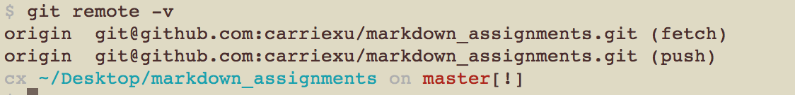
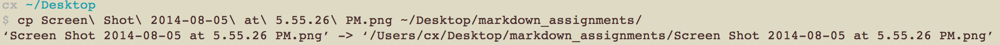

###CommandLine Reinforcenment HW###
|number|Commands | Command Description |
|----------|-------------|-------------|
|1|`git remote -v`|to check if you are tethered to any remote repository |
|2|`git add .`|to add all the files in the current folder|
|3|`cmd + k + b`|to add a side bar in sublime text, but must open from terminal using `subl .`|
|4|`cmd + tab`|to switch between applications|
|5|`ctrl + tab` or `shift + cmd + [`|to switch between tabs within an application|
|6|`cp <file_name> <target_location>`|to copy a file into another location |
|7|`git push origin master`|to push files in the staged area to the master branch of my GitHub repository|
|8|`git pull upstream master`|to pull means to get the files in the repository I am copying from, and get it into my own local repository, upstream is a remote repository that we do not have write access to.|
|9|`git clone`|copies an existing Git repository, cloning automatically creates a remote connection called origin pointing back to the original repository|
|10|`git remote add <name> <url>`|creates a new connection to a remote repository, after adding a remote, we will be able to use <name> as a convenient short cut for <url> in other Git commands|

